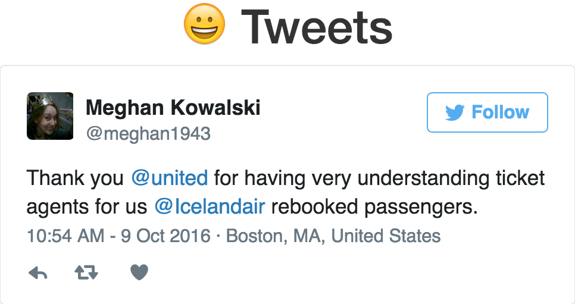
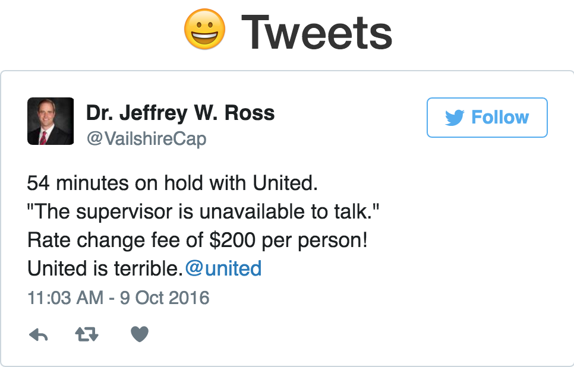
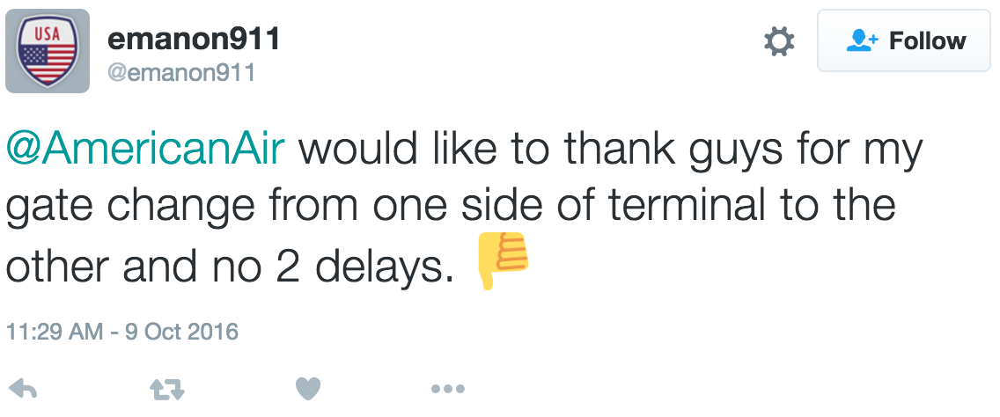
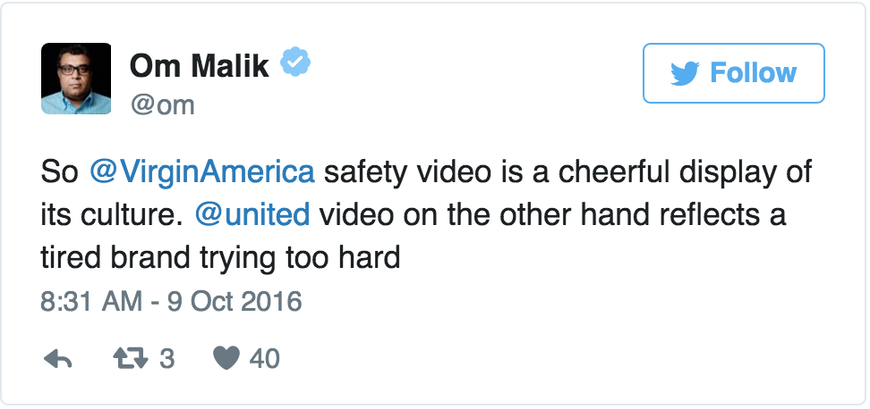

# Final Report

## Sentiment Analysis
In order to create a sentiment analysis web application for customer
service representitives of various companies to gather feedback about
their airline, we first needed to be able to gather data from twitter.
We found that the twitter streaming API would best suite our use case,
because while we wanted our representitives to be able to responsed to
be able to respond to potentially every single tweet for their airline.
The rest API twitter provied didn't allow us to request more than 100
tweets at a time and our application would have to maintain a data structure
to determine whether or not a tweet has been responded to.

In order to analyze the sentiment of every tweet we needed to create
an additional service that would clasify the sentiment of the tweets
streaming. In order to cut the cost of using a service like Google's
Sentiment Analysis API, we used the VADER library. VADER is a part
of a very popular python package, NLTK, and is designed to correctly
classify social media tweets ([see paper](http://comp.social.gatech.edu/papers/icwsm14.vader.hutto.pdf)).

After the tweets were analyzed for sentiment, our main server would
stream the tweets to all representitives connected to the website.
From the website representitives would be able to respond directly
to the person tweeting at the airline and address the potential concern
the person might have.

We found that overall airlines are fairly effective in responding to
tweets with sentiment, responding within minutes of complaints being made.
We believe that this indicates some combination of sentiment analysis tools
or an overstaffed consumer representive staff.

## The Data
While we found that the *VADER* library performed very well for tweets
(see correctly classified tweets in figure 1 and figure 2)
we found that we would need to tune the algorithm in order to
produce more false negatives than positives.

The tweet in figure 1.3 shows an example of an incorrectly classified tweet.
Two of Dr. Jeffery W. Ross' were correctly classified while this tweet has
been classified incorrectly. Tweets like these stood out amongst other
incorrectly classfied tweets. Other tweets might have elements like sarcasm
which made for difficult classification, but Ross' tweet contains no sarcasm
and the sentiment seems straightforward.

Figure 1.4 shows an incorrectly classified sarcastic tweet. We found that
the great majority of tweets that streamed through our application were
incorrectly classified due to the usage of the word *thank*.

## Mapping Sentiment to Airports
In inspecting the tweets streaming in, we found that the great majority
of users were not including their location in their tweets. We wanted to
be able to map out where user's were flying or which airport they might
be located at to guage critical problems at particular locations. In order
to achieve our goal we were able to extract the airport codes from the
tweets that were passed in the tweets and mapped them to a particular
latitude and longitude using a dataset source from [openflights.org](http://openflights.org/data.html).
After determing the sentiment of the tweet, we then were able to
pin the user's location or location of arrival/departure on the map
with their corresponding sentiment.

## Sentiment Influence
In order to distinguish which airlines were performing particularly well with
customers we measured the influence of a particular user based on the number
of twitter followers a user has, because we could not measure the number of
views of the tweet. It was also decided that to preemtively respond to the
tweet of a user with more followers would generate more views of a sales
representives repsonse.

$$\text{Sentiment Influence} = \text{Sentiment} * \text{Influence}$$

An example of a tweet with a large sentiment influence is Om Malik's tweet (see figure 4).
Malik is a registered user on twitter with 1.5M followers. Simply put
his tweets will garner more views than someone with a smaller network.
Tweets from users like Om Malik become a high priority as the network effect
is stronger for responses to these tweets.

Lastly, we created a visualization of sentiment analysis with a realtime chart of
average sentiment influence over time.
Representitives will be familiar to the real time chart based their usage in finance.
In the chart in figure 5, we can see exactly when Om Malik tweeted at @JetBlue.
